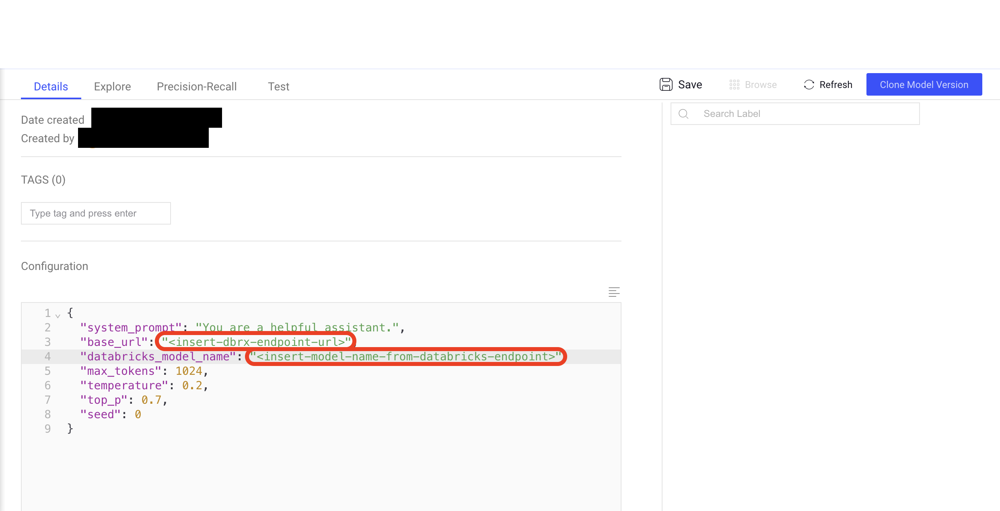
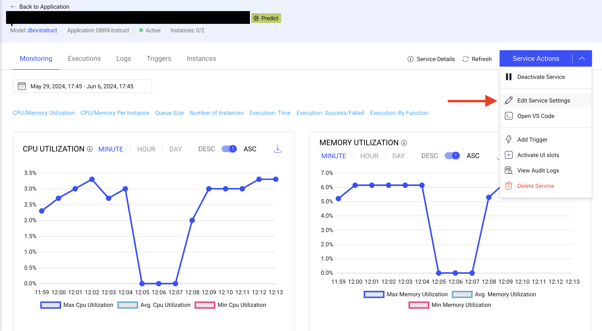
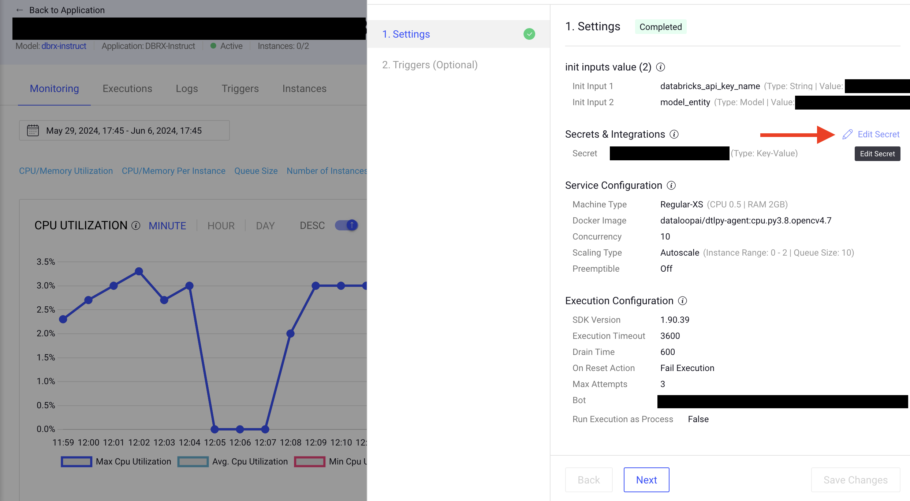
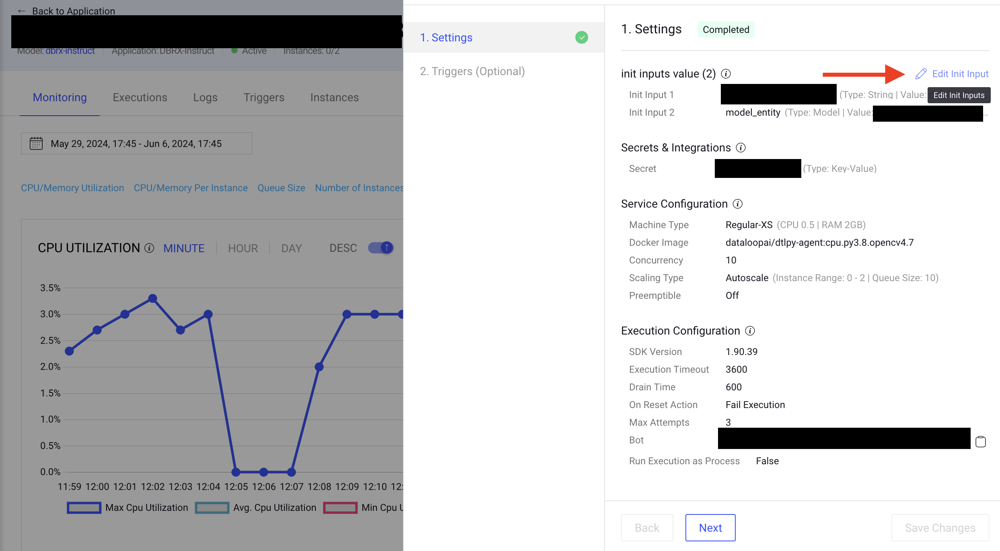
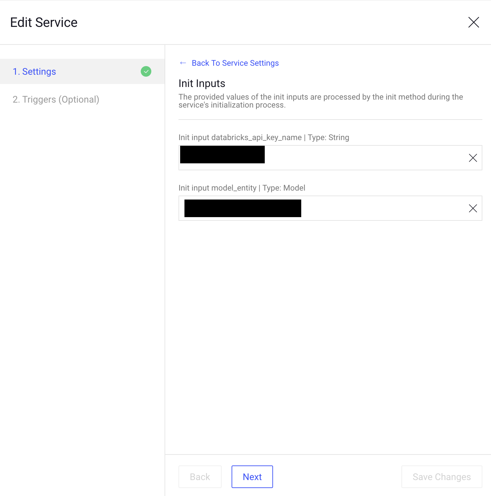

# DBRX-instruct

A state-of-the-art LLM using MoE architecture to better provide precise answers across multiple fields of knowledge. The ```instruct``` version means it is fine-tuned and prepared to be served as a conversational model.

To use this model it will be necessary to create a serving endpoint in your Databricks workspace. Consult [this page](https://docs.databricks.com/en/machine-learning/model-serving/index.html) for further instruction.

## Configuration:

Once you install this model adapter in a project in the Dataloop platform, visit its model page to finish its configuration. There you will need to change the two fields marked with the red rectangles here:



these fields should be filled with information taken from your Databricks serving endpoint:

* ```databricks_model_name```: this should be the name of the model you chose during the endpoint creation.
* ```base_url```: The base url as appears in your workspace. It should follow a format like: "https://adb-xxxxxxxxx.y.azuredatabricks.net/serving-endpoints" where the ```x```s represent your 9-digit workspace number and ```y``` is a randomized number. This url uses Azure as a cloud provider, which could be changed for GCP or AWS.

Lastly, it will be required to add your Databricks access token as a secret in the service. Visit [this page](https://docs.databricks.com/en/dev-tools/auth/pat.html) to obtain more information on how to generate your Databricks Access Token. And [here](https://docs.dataloop.ai/docs/secrets-overview?highlight=secrets) you can find information on how to securely add your token as a secret in the Dataloop platform.

Once the model is [deployed](https://docs.dataloop.ai/docs/model-deployment?highlight=deploy) in your project, go to its service page, and select to edit its settings:


First, add the secret you created to the service by selecting the following option:



and then selecting the secret from the dropdown menu. After that, edit its ```init_inputs``` by selecting the following option:



The ```databricks_api_key_name``` should be the string you used as a key for the secret containing your Databricks Token:



you can keep the ```model_entity``` value. Save the configurations and the service should be ready to be used for predictions in the Dataloop platform.


